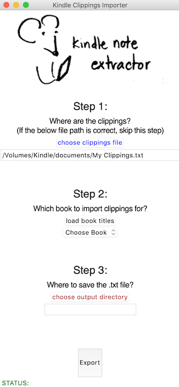

# kindle-notes

This is a GUI application that extracts your notes and highlights from your kindle. (Amazon only lets you do it for some books, but not for pdfs and files you download manually.)

## How to use:

Download the repository, then run kindle_gui.py

A sample clippings file is available in the "sample" folder. Otherwise, you can find your My Clippings.txt file in the "documents" folder of your Kindle.

### Required packages
- Make sure to install Pillow (listed in requirements.txt)
- tkinter is imported automatically
